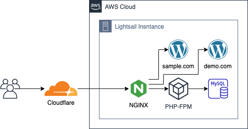

# Host WordPress

An instruction page for how to set up WordPress multiple sites without using WP Multisite feature.<br>
One of the limitation of using WP Multisite feature is that there are some plugiins which does not work with Multisite.<br>
This instruction focuses on the minimum running cost for hobby sites.

## Knowledge Requirement

- Basic knowledge of Unix commands (i.e. `cd`, `cp` etc)

## Environemnt

- Local OS: MacOS
- Server OS: Amazon Linux 2
- Compoents
    - Nginx
    - PHP-FPM
    - MySQL

Note: apparently Nginx has some advantage over Apache for performance, and what is more, it is easy to configure.

## Architecture



Note: I use Cloudflare for Name Server and CDN. The equivalent service in AWS is Route 53 for Name Server and CloudFront for CDN.

## Domain Setup

Register your domain via Domain Registrar (i.e. Godaddy, Google Domain, Route 53)

## Nameserver Setup

### Cloudflare

1. Access Cloudflare Console > DNS
2. Set up A record and CNAME such as the screenshot below<br>
    <br>
    Since you do not have an IP yet, just remember to come back here after you get static IP
3. You should also find Nameserver info on the same page, copy them for the next part

```
Q: Can I point to the same IP address from another domain(s)?
A: Yes, this instruction focusing on creating one single server consuming different domains.
```

### Domain Registrar

1. Access your domain registrar
2. Find the section where you can change Nameserver. Here is the screenshot for Google Domain<br>
    
3. Configure Name Server pointing to your favorite Nameserver service such as Cloudflare<br>
    (The Domain pointing to your Nameserver takes up to 1 day.)

```
Q: Can I point to the same Nameserver from another domain(s)?
A: Yes, NGINX handle the routing and points to an appropriate WordPress site with nginx conf file which you can find in the following instruction.
```

So now you have set up the flow **Domain** > **Nameserver** > **Server**

## Instance Setup

### Create Instance

1. Access AWS Console > Lightsail
2. Click **Create instance**
3. Select a platform and a blueprint
    
4. Add the following as a launch script
    ```bash
    # yum update
    sudo yum update -y

    # git
    sudo yum install -y git

    # Swap Setup
    ## allocate Swap (db=blocksize, count=# of blocks)
    sudo dd if=/dev/zero of=/swapfile bs=1M count=1000
    ## update the read and write permissions for the swap file:
    sudo chmod 600 /swapfile
    ## set up a Linux swap area:
    sudo mkswap /swapfile
    ## make the swap file available for immediate use by adding the swap file to swap space:
    sudo swapon /swapfile
    ## verify that the procedure was successful:
    #sudo swapon -s
    ## enable the swap file at boot time by appending the following in the /etc/fstab file:
    echo "/swapfile swap swap defaults 0 0" | sudo tee -a /etc/fstab

    # NGINX
    ## install nginx
    sudo amazon-linux-extras install nginx1
    ## start nginx service
    sudo systemctl start nginx
    ## enable nginx service to start at each system boot
    sudo systemctl enable nginx

    # PHP
    ## find available php version
    #sudo amazon-linux-extras | grep php
    ## install the latest php version (i.e. v7.4)
    sudo amazon-linux-extras enable php7.4
    sudo yum clean -y metadata
    sudo yum install -y php-cli php-pdo php-fpm php-json php-mysqlnd php-gd php-opcache php-xmlrpc
    ## install mb-string
    sudo yum install -y php-mbstring
    ## install imagick
    sudo yum install -y php-pear php-devel gcc ImageMagick ImageMagick-devel
    pecl install -y imagick
    echo "extension=imagick.so" > sudo tee -a /etc/php.d/imagick.ini
    ## start php-fpm service
    sudo systemctl start php-fpm.service
    ## enable php-fpm service to start at each system boot
    sudo systemctl enable php-fpm.service

    # MySQL
    ## install Extra Packages for Enterprise Linux (EPEL)
    sudo amazon-linux-extras install epel
    ## add mysql yum repository
    sudo yum install -y https://dev.mysql.com/get/mysql57-community-release-el7-11.noarch.rpm
    ## install MySQL
    sudo yum install -y mysql-community-server
    ## check version
    #mysqld --version
    ## start MySQL server
    sudo systemctl start mysqld.service
    ## enable to start at each system boot
    sudo systemctl enable mysqld.service
    ```
5. Select an instance spec (below is the minimum spec over 3 sites from my experience)
    - **OS**: Amazon Linux 2
    - **Spec**: 1GB, 1 vCPU, 40 GB SSD
6. Click **Create instance**

### Networking Setup

#### Static IP Setup

?> This static IP is what we need in order to access the instance

1. Select the newly created instance and click **Networking** tab
    <div></div>
2. In **IPv4 networking** section, click **+ Create static IP**
3. Click **Create**

#### Enable HTTPS Port

?> Port 443 is used for HTTPS access on browser to secure transaction

1. In the same **Networking** tab and in **IPv4 Firewall** section, click **+ Add rule**
2. Select `HTTPS` and click **Create**
    <div></div>

#### Disable IPv6

1. In the same **Networking** tab and in **IPv6 networking** section, toggle **IPv6 networking is enabled** off

## Local Setup

### SSH to Insntace

1. Go to Lightsail Account page where you can find the menu on the top right corner
2. Select **SSH Keys** tab
3. Select the Default option under your region and download the key pair file. ex. `LightsailDefaultPrivateKey-us-east-1.pem` in Downloads folder (if you did not specify the key when creating an instance, default should be the only option)
4. Store it in `~/.ssh`
    ```bash
    cp ~/Downloads/LightsailDefaultPrivateKey-us-east-1.pem ~/.ssh
    ```
5. Restrict file permission so only you can read it
    ```bash
    chmod 600 ~/.ssh/LightsailDefaultPrivateKey-us-east-1.pem
    ```
6. Run `ssh -i ~/.ssh/LightsailDefaultPrivateKey-us-east-1.pem [username]@[Public IP]` to establish the connection to Lightsail

You can find `[username]` and `[Public IP]` by selecting your instance on Lightsail Web Dashboard and select "**Connect**" tab

In case the instance was changed and IP was changed, execute the following on your local machine

```bash
ssh-keygen -R SERVER_IP_ADDRESS
```

### SFTP for File Transfer

1. Download your favorite SFTP client on your local machine (i.e. Cyberduck)
2. Add the config similar to the screenshot below (change `0.0.0.0` to your static IP)
    <div></div>

## Server Setup

SSH to the server

Note: alternatively you can ssh to the server from **Connect** tab and by clicking **Connect using SSH**

### PHP-FPM Setup

1. Open `/etc/php-fpm.d/www.conf` and find **apache** in the user and group and replace it with **nginx**

    ```bash
    sudo vi /etc/php-fpm.d/www.conf
    ```

    `/etc/php-fpm.d/www.conf`

    ```conf
    ...
    user = nginx
    group = nginx
    ...
    ```

2. make sure to restart php-fpm

    ```bash
    sudo systemctl restart php-fpm.service
    ```

### Nginx Setup

1. Add cert and private key (I grabed the SSL cert from Cloudflare)

    ```bash
    vi /etc/ssl/sample.com.key
    vi /etc/ssl/sample.com.pem
    ```

    Note: SSL cert config is out of scope for this instruction, but if you are using Cloudflare, you can generate the cert from the [this instruction](https://support.cloudflare.com/hc/en-us/articles/115000479507)

2. Add a NGINX conf file into `/etc/nginx/conf.d`. (replace `sample.com` with your domain)

    File name: `sample.com.conf`

    ```conf
    # sample.com
    server {
        listen       443 ssl http2;
        listen       [::]:443 ssl http2;
        server_name  sample.com www.sample.com;
        root         /var/www/sample.com;
        index        index.html index.htm index.php;

        ssl_certificate "/etc/ssl/sample.com.pem";
        ssl_certificate_key "/etc/ssl/sample.com.key";

        # Load configuration files for the default server block.
        include /etc/nginx/default.d/*.conf;

        location / {
            # try_files $uri $uri/ =404;
            try_files $uri $uri/ /index.php?q=$uri&$args;
        }
    }
    ```

    Note: Repeat this step if you have another site(s)

3. Create site folders

    ```bash
    sudo su -
    mkdir -p /var/www/sample.com
    echo "<?php phpinfo(); ?>"  > /var/www/sample.com/test.php 
    chown nginx:nginx /var/www
    ```

    Note: Repeat this step if you have another site(s)

4. Restart nginx

    ```bash
    sudo systemctl restart nginx
    ```

5. Test http://IP_ADDRESS/test.php

6. execute the following for error log

    ```bash
    sudo tail -f /var/log/nginx/error.log
    ```

Note: if something got stuck by error, check the following Nginx files by referring to [this](https://github.com/htakemoto/wordpress-hosting/blob/main/nginx)

```
/etc
+- nginx
   +- conf.d
   |  +- php-fpm.conf
   |  +- sample.com.conf
   +- default.d
   |  +- php.conf
   +- nginx.conf
```


### MySQL Setup

1. Setup MySQL

    ```bash
    # get the first temp password
    sudo cat /var/log/mysqld.log | grep password
    # secure MySQL service
    sudo mysql_secure_installation
    (type Y for all)
    ```

2. Create DATABASE

    login mysql

    ```bash
    mysql -u root -p
    ```
    
    execute the following SQL script

    ```sql
    -- for sample.com
    CREATE DATABASE IF NOT EXISTS `sample`;
    -- for demo.com
    CREATE DATABASE IF NOT EXISTS `demo`;
    ```

    Note: WordPress requires database for each site

3. Setup DB User

    login mysql

    ```bash
    mysql -u root -p
    ```
    
    execute the following SQL script

    ```sql
    -- for sample.com
    CREATE USER 'sample'@'localhost' IDENTIFIED BY 'changeme';
    GRANT ALL ON sample.* TO 'sample'@'localhost' WITH GRANT OPTION;
    -- for demo.com
    CREATE USER 'demo'@'localhost' IDENTIFIED BY 'changeme';
    GRANT ALL ON demo.* TO 'demo'@'localhost' WITH GRANT OPTION;
    FLUSH PRIVILEGES;
    ```

    update password for exisiting DB user

    ```sql
    SET PASSWORD FOR 'sample'@'localhost' = PASSWORD('changeme');
    SET PASSWORD FOR 'demo'@'localhost' = PASSWORD('changeme');
    ```

### File Permission Setup

add ec2-user into nginx group

```bash
sudo su -
# add ec2-user into nginx group
usermod -a -G nginx ec2-user
# logout (important)
logout
```

login again

```bash
sudo su -
# make sure folder permissions
chown -R nginx:nginx /var/www/*
# set GID in sample.com directory
# from now on, any files created under this folder by ec2-user will be nginx group 
chmod 2775 /var/www/sample.com
# (make sure group permissions i.e. 644 for file, 755 for folder under this directory)
ll /var/www/sample.com
```

Note: Repeat this step if you have another site(s)

## Import Existing WordPress

1. Upload and extract backup zip file

    ```bash
    cd /home/ec2-user
    unzip -q sample.zip -d sample
    ```

2. Import Data into Database

    ```bash
    mysql -u sample -p --database=sample < sample/backup.sql
    ```

3. Copy WordPress file

!> Make sure not to copy backup files such as backup.sql 

    ```bash
    cp -a /home/ec2-user/sample/. /var/www/sample.com
    ```

4. Configure the following at `/var/www/sample.com/wp-config.php`

    - Database name
    - Database username
    - Database password
    - Database server

5. Configure WordPress files

    ```bash
    chown -R nginx:nginx /var/www/*
    sudo find /var/www -type f -exec chmod 644 {} +
    sudo find /var/www -type d -exec chmod 755 {} +
    ```

## Apendix

### Remove Swap

remove swap file

```bash
sudo swapoff -v /swapfile
sudo rm /swapfile
```

disable the swap file at boot time by editing the `/etc/fstab` file

```bash
# /swapfile swap swap defaults 0 0
```

### MySQL Import/Export

```bash
# export
mysqldump -u username -p dbname > dbexport.sql
# import
mysql -u username -p dynamo < dbexport.sql
```

### MySQL Change PW for root user

```bash
# change root password
mysql -u root -p
mysql> use mysql;
mysql> SET PASSWORD FOR 'root'@'localhost' = PASSWORD("newpass");
mysql> flush privileges;
mysql> quit
```

### MySQL Check all tables under the database

```bash
mysql> SELECT table_name from information_schema.tables where table_schema = 'sample';
```

### MySQL Delete all tables under ’sample’ database

```bash
echo "SET FOREIGN_KEY_CHECKS = 0;" > ./temp.sql
mysqldump --add-drop-table -u db_admin -p sample | grep 'DROP TABLE' >> ./temp.sql
echo "SET FOREIGN_KEY_CHECKS = 1;" >> ./temp.sql
mysql -u db_admin -p sample < ./temp.sql
```

### Install WordPress from scratch

```bash
sudo su -
mkdir -p /var/www/sample.com
cd /var/www/sample.com
wget https://wordpress.org/latest.tar.gz
tar -zxvf latest.tar.gz
mv wordpress/* .
rm -rf wordpress
cp wp-config-sample.php wp-config.php
vi wp-config.php
>>
define('DB_NAME', 'wordpress-db');
define('DB_USER', 'wordpress-user');
define('DB_PASSWORD', 'your_strong_password');
..
define('AUTH_KEY', '');
define('SECURE_AUTH_KEY', '');
define('LOGGED_IN_KEY', '');
define('NONCE_KEY', '');
define('AUTH_SALT', '');
define('SECURE_AUTH_SALT', '');
define('LOGGED_IN_SALT', '');
define('NONCE_SALT', '');
obtain from
https://api.wordpress.org/secret-key/1.1/salt/

EOF
chown nginx:nginx -R /var/www
```

### DBeaver Setup

No server config is required using SSH tunnel

- **Server Host**: 127.0.0.1
- **Port**: 3306
- **Database**: sample
- **Username**: sample_admin
- **Password**: changeme

Use SSH Tunnel
- **Host/IP**: 0.0.0.0 (static IP)
- **Port**: 22
- **Username**: ec2-user
- **Auth Method**: Public Ke
- **Private Key**: same as ssh key under ~/.ssh

Note: ignore password prompt if it pops up
